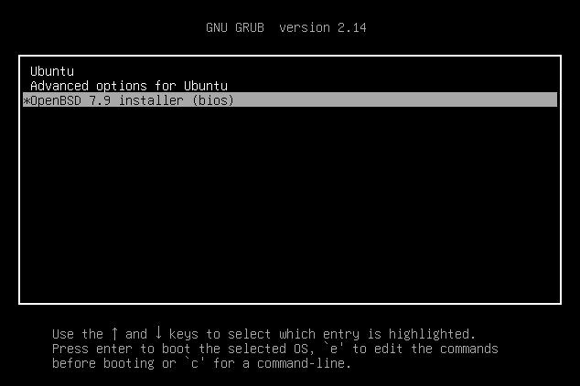
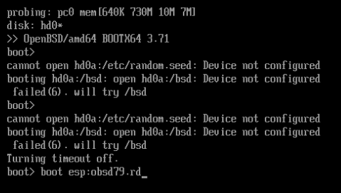

# openbsd-setup-ovh (2026)
Boot the OpenBSD installer via GRUB on OVHcloud VPS. Supports Debian/Ubuntu with BIOS and UEFI.

Prepare an existing Debian or Ubuntu VPS to boot the OpenBSD installer from GRUB, using the OVH KVM console. Supports x86_64 BIOS/Legacy and 64-bit UEFI boot paths.

The script downloads the OpenBSD ramdisk kernel (`bsd.rd`), verifies its SHA256 checksum, and adds an installer entry to the existing GRUB menu. UEFI systems also use OpenBSD's native `BOOTX64.EFI` loader. **No ISO attachment is required.**

**Scope:** prepare the installer boot environment. The script does not partition or format disks, install OpenBSD, configure networking, or reboot automatically.

## Requirements and compatibility

### Host operating systems

Run the script on the Linux system you intend to replace, before installing OpenBSD.

| Host operating system | x86_64 BIOS/Legacy | x86_64 UEFI |
| --- | --- | --- |
| Debian 11 | Targeted | Targeted |
| Debian 12 | Targeted | Targeted |
| Debian 13 | Targeted | Targeted |
| Ubuntu 22.04 LTS | Targeted | Targeted |
| Ubuntu 24.04 LTS | Targeted | Targeted |
| Ubuntu 26.04 LTS | Targeted | Targeted |

These are the versions accepted by the script. Each requires an `amd64` userland, Bash, root access, and a working GRUB installation that the machine actually uses at boot. **This table is not a record of successful boot tests on every combination.** See [Validation](#validation) for the tested scope.

### Firmware and storage layouts

| Configuration | Support and requirements |
| --- | --- |
| BIOS/Legacy | GRUB loads `bsd.rd` directly using `kopenbsd`. The active `/boot/grub/i386-pc/` directory must contain the required BIOS GRUB modules, including `bsd.mod`. |
| 64-bit UEFI | Requires Secure Boot disabled, a mounted writable FAT EFI System Partition (ESP), and OpenBSD **7.9 or later**. One command must be entered at the OpenBSD `boot>` prompt. |
| GPT or MBR partition tables | Both are handled. The script detects the running firmware mode independently of the partition table. |
| `/boot` inside the Linux root filesystem | Supported when its storage is directly accessible and readable by GRUB. |
| A separate `/boot` partition | Supported under the same conditions. Filesystem UUIDs and GRUB-relative paths avoid fixed disk or partition numbers. |
| LVM, software RAID, or encrypted boot storage | Not supported for the partition holding the OpenBSD boot files. The script rejects storage abstractions reported by `grub-probe`. |
| UEFI with Linux root on LVM, software RAID, or encryption | Can be used when the OpenBSD boot files are stored on a separate, directly accessible FAT ESP that passes the checks. |
| Secure Boot enabled or its status unreadable | Rejected. The script does not disable Secure Boot or change firmware settings. |
| systemd-boot, direct UKI boot, or no active GRUB | Not supported. The script does not install GRUB or change which bootloader the firmware uses. |
| ARM, 32-bit x86, or 32-bit UEFI | Not supported. |

At least **16 MiB of free space** is checked on `/boot` for BIOS, or on the ESP for UEFI. Internet access is required to download the release files. Missing `curl`, CA certificates, or GRUB utilities may be installed through APT during a normal run.

## Before you start

- **Back up data before replacing the operating system.** This script prepares boot files, but continuing through the OpenBSD installer can erase the existing Linux installation and other selected disks.
- **Confirm that the OVH KVM console works and that you can use its keyboard.** Keep it open for the reboot; the OpenBSD installer does not inherit your Linux SSH session or configuration. Have access to your provider's recovery options if boot fails.
- **Save your VPS network information somewhere outside the VPS:** IPv4/IPv6 addresses, prefix lengths, gateways, DNS servers, and any provider-specific routes. The script does not migrate them. The ramdisk does not contain the full installation sets; a subsequent installation normally downloads them after networking is configured.
- **Review the script before running it as root.** It writes boot files and GRUB configuration, and may install dependencies. A successful preflight cannot guarantee a successful boot on your firmware.

## Usage

### 1. Download and select the OpenBSD release

Download this repository using GitHub's **Code → Download ZIP**, or download the [`openbsd-setup-ovh.sh`](openbsd-setup-ovh.sh) file. Copy the script to the target Linux VPS and open a shell in the directory containing it.

The default release is selected near the top of the script:

```bash
OPENBSD_VERSION="7.9"
```

Change this field if needed **before running the script**. See [Version selection](#version-selection) for how all release-specific values are derived.

### 2. Check the system and prepare GRUB

Optional read-only preflight:

```bash
sudo bash openbsd-setup-ovh.sh --check
```

Prepare the installer entry:

```bash
sudo bash openbsd-setup-ovh.sh
```

Use **Bash**, not `sh`. If already logged in as root, omit `sudo`. An executable permission change is unnecessary when using `bash` explicitly.

| Option | Behavior |
| --- | --- |
| `--help` | Show usage, the selected release, download URLs, and the UEFI boot command. Does not require root. |
| `--check` | Run read-only host, firmware, storage, dependency, and managed-configuration checks. Requires root. Does not download files, install packages, or modify files. |
| `--esp PATH` | Use an **already mounted** ESP at the given path. UEFI only; may be combined with `--check`. |

`--check` does not test mirror availability, validate downloaded files, or attempt a boot. If it reports missing installable dependencies, a normal run can install them through APT.

For UEFI, the script searches `/boot/efi`, `/efi`, and `/boot` for a valid mounted ESP. To use another mount point:

```bash
sudo bash openbsd-setup-ovh.sh --check --esp /mnt/esp
sudo bash openbsd-setup-ovh.sh --esp /mnt/esp
```

Replace `/mnt/esp` with your actual ESP mount point. The script does not create, format, or mount the partition.

### 3. Reboot and continue through OVH KVM

After the script prints **`Ready:`**, the next steps are to restart the server and continue through **that VPS's KVM console in the OVHcloud Control Panel**.

Have the console ready before restarting so you do not miss the GRUB menu:

1. Sign in to the **OVHcloud Control Panel** and select the VPS on which you ran the script.
2. Open its **General information** tab. In the **Your VPS** section, open the `...` menu next to the VPS name and launch **KVM**.
3. Allow the console popup if your browser blocks it, and keep the KVM window open. See [OVHcloud's KVM guide](https://docs.ovhcloud.com/en/guides/bare-metal-cloud/virtual-private-servers/using-kvm-for-vps) for the panel controls.

Then reboot manually from your Linux shell:

```bash
sudo reboot
```

After the restart, switch to the KVM window and continue there. Your Linux SSH connection will close during reboot.

GRUB displays its menu for **15 seconds**. Use the arrow keys to select `OpenBSD 7.9 installer (bios)` or `OpenBSD 7.9 installer (uefi)`, then press **Enter**. The release number follows your selected version. The script preserves the existing `GRUB_DEFAULT` setting; it does not automatically select OpenBSD. If you miss the menu and Linux boots, keep KVM open and reboot again from Linux.



*Example BIOS menu on Ubuntu. UEFI systems show `(uefi)` in the entry title. Menu appearance and the displayed GRUB version depend on the host.*

### 4. Start the installer: BIOS or UEFI

**BIOS/Legacy:** selecting the GRUB entry loads the OpenBSD ramdisk kernel directly. No `esp:` command is needed.

**UEFI:** selecting the GRUB entry starts the OpenBSD EFI loader. At its **`boot>`** prompt, type the command printed by the setup script. For OpenBSD 7.9:

```text
boot esp:obsd79.rd
```

Type only the command above, without the `boot>` prompt, and press **Enter**. This is entered in the KVM console, not in the Linux shell or the GRUB command line.



*UEFI example: the command is entered and ready to submit. This is a different boot path from the BIOS menu example above.*

The loader may first report that it cannot open `hd0a:/bsd`, `/etc/random.seed`, or an OpenBSD partition. When Linux still occupies the disk, these messages can come from its default attempt to find an installed OpenBSD system. Use the explicit `esp:` command to load the prepared ramdisk from the ESP.

The boot goal is reached when the OpenBSD installation program appears:

```text
Welcome to the OpenBSD/amd64 7.9 installation program.
(I)nstall, (U)pgrade, (A)utoinstall or (S)hell?
```

Further installation is manual. Consult the [OpenBSD installation guide](https://www.openbsd.org/faq/faq4.html) before selecting disks or installing the system.

## Version selection

Only edit `OPENBSD_VERSION` in the script. For example:

```bash
OPENBSD_VERSION="8.0"
```

The script derives all of these values automatically:

| Value | Example for `8.0` |
| --- | --- |
| Release code | `80` |
| Download directory | `https://cdn.openbsd.org/pub/OpenBSD/8.0/amd64` |
| Downloaded filenames | `SHA256`, `bsd.rd`, and, for UEFI, `BOOTX64.EFI` |
| BIOS kernel path | `/boot/openbsd-installer/80/bsd.rd` |
| UEFI loader path, relative to ESP | `EFI/OpenBSD-Installer/80/BOOTX64.EFI` |
| UEFI kernel path, relative to ESP | `obsd80.rd` |
| GRUB title | `OpenBSD 8.0 installer (bios)` or `(uefi)` |
| UEFI console command | `boot esp:obsd80.rd` |

**`8.0` is a version-selection example, not a claim that this release is available or boot-tested.** The selected release must be published at the derived mirror location and provide the expected files and boot behavior. An unavailable release causes a download error. UEFI rejects releases older than 7.9.

Re-running the script updates its single managed GRUB entry. Boot files use separate release paths; files from earlier selected releases are not automatically removed.

## System changes and download verification

For the default OpenBSD 7.9 selection:

| Location | Purpose |
| --- | --- |
| `/boot/openbsd-installer/79/bsd.rd` | BIOS ramdisk kernel; BIOS mode only. |
| `<ESP>/EFI/OpenBSD-Installer/79/BOOTX64.EFI` | Native OpenBSD EFI loader; UEFI mode only. |
| `<ESP>/obsd79.rd` | Ramdisk kernel read by the EFI loader; UEFI mode only. |
| `/etc/grub.d/42_openbsd_installer` | Managed GRUB entry generator. |
| `/etc/default/grub.d/zz-openbsd-installer.cfg` | Show the GRUB menu with a 15-second timeout. |
| `/boot/grub/grub.cfg` | Regenerated and syntax-checked GRUB configuration. |

`<ESP>` means the detected or explicitly selected ESP mount point. The script does not edit `40_custom`; older entries added there may remain visible. It does not run `grub-install`, modify UEFI NVRAM, or replace other EFI loaders.

Downloads use HTTPS. The script reads the selected release's official `SHA256` manifest and checks each required boot file against it before writing boot files or managed GRUB configuration. Missing, malformed, duplicate, or mismatching checksum entries cause failure. **It does not verify `SHA256.sig` with `signify`, and the checksums are not pinned in the script.**

The new GRUB configuration is generated in a temporary file, checked with `grub-script-check`, and then replaces `grub.cfg` atomically. If setup fails before completion, cleanup attempts to restore tracked files. Dependency installations and newly created directories are not rolled back. This mechanism is not a substitute for backups or recovery access after a power loss or an unbootable configuration.

## Troubleshooting

| Message or symptom | What to check |
| --- | --- |
| `Unsupported host release` | Use one of the exact Debian/Ubuntu versions listed above; derivatives are not automatically accepted. |
| `No existing GRUB configuration was found` | This tool needs an existing, active GRUB installation. It does not convert another bootloader to GRUB. |
| Secure Boot enabled or unreadable | Disable Secure Boot through the available firmware/provider controls and reboot Linux. If the status cannot be read, check whether efivarfs is mounted and readable. |
| `No mounted FAT EFI System Partition was found` | Confirm the correct existing ESP is mounted and writable. Use `--esp` for a nonstandard mount point. An ordinary FAT partition is insufficient. |
| Missing `bsd.mod` or another active BIOS module | Check the existing BIOS GRUB installation and `grub-pc-bin` modules. The script does not repair the bootloader. |
| `Unsupported storage abstraction` | The boot files must be on directly accessible storage. In UEFI mode, this check applies to the ESP; in BIOS mode, it applies to `/boot`. |
| Download or SHA256 error | Check the selected release, mirror access, and any pre-existing file named in the error. Resolve the error and rerun; do not treat failed setup as ready to reboot. |
| Refusing to overwrite an unmanaged file or symbolic link | Inspect the named path and resolve the conflict before rerunning. Unmarked GRUB entry/default configuration files and symbolic links are not overwritten. |
| OpenBSD entry is absent at reboot | Confirm that the machine actually boots the GRUB configuration generated by this script. Merely having `/boot/grub/grub.cfg` on disk does not prove this. |
| EFI loader cannot find the ramdisk | Enter the exact `boot esp:obsdXX.rd` command printed by your successful setup run. Check the release-specific filename and which ESP the loader was started from. |

## Validation

- **Successful tests:** I successfully used the original BIOS method on an OVH Cloud VPS initially running Debian 11. I then completed a full OpenBSD installation with both IPv4 and IPv6 networking fully operational (dual stack). I also successfully tested the script on Ubuntu 26.04. This is not an end-to-end test of every later script revision.
- **UEFI boot path:** a separate VirtualBox EFI64 test reached the OpenBSD 7.9 installer through Debian GRUB EFI, OpenBSD's native EFI loader, and `boot esp:obsd79.rd`, without an ISO. This tested the boot chain, not the complete preparation script on every target OS or OVH UEFI firmware.

I successfully tested the script on both Debian 11 and Ubuntu 26.04. You can achieve the same result on the other supported Debian and Ubuntu releases when the requirements above are met. The screenshots illustrate the console steps; they do not expand the validation scope.

---

Designed by **Özgür Konstantin Kazanççı** — [ozgur@kazancci.com](mailto:ozgur@kazancci.com) (2026).
